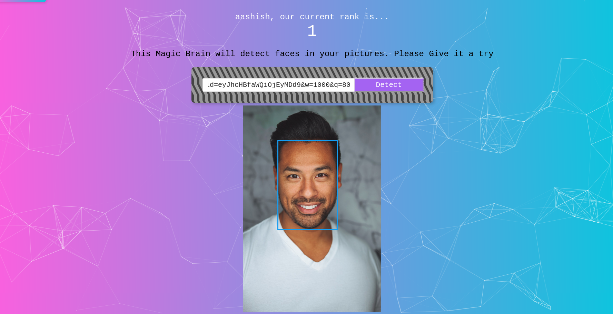

<div align="center">
  
</div>
<h1 align="center">
  SmartFaceRecognition
</h1>
<p align="center">
  Full Stack Face Recognition WebApp built using React, Node, Clarifai API and hash secured Postgres database deployed on Heroku Platform.
</p>
<p align="center">
  <a href="https://smart-face123.herokuapp.com/" target="_blank">
    
  </a>
</p>



## 🛠 Installation & Set Up

You have to set up both <a href="https://github.com/aashish-khatri/smart-face-backend" target="_blank">backend</a> and frontend server.

1. Create a folder

   ```bash
   mkdir smart-face
   cd smart-face
   ```

2. Clone the frontend repository.

   ```bash
   git clone https://github.com/aashish-khatri/smart-face-frontend.git
   ```

3. Install dependencies

   ```bash
   npm install
   ```

4. Start the development server

   ```bash
   npm start
   ```
## Note 
This project is a part Andrew Negoi's web developer udemy course.
